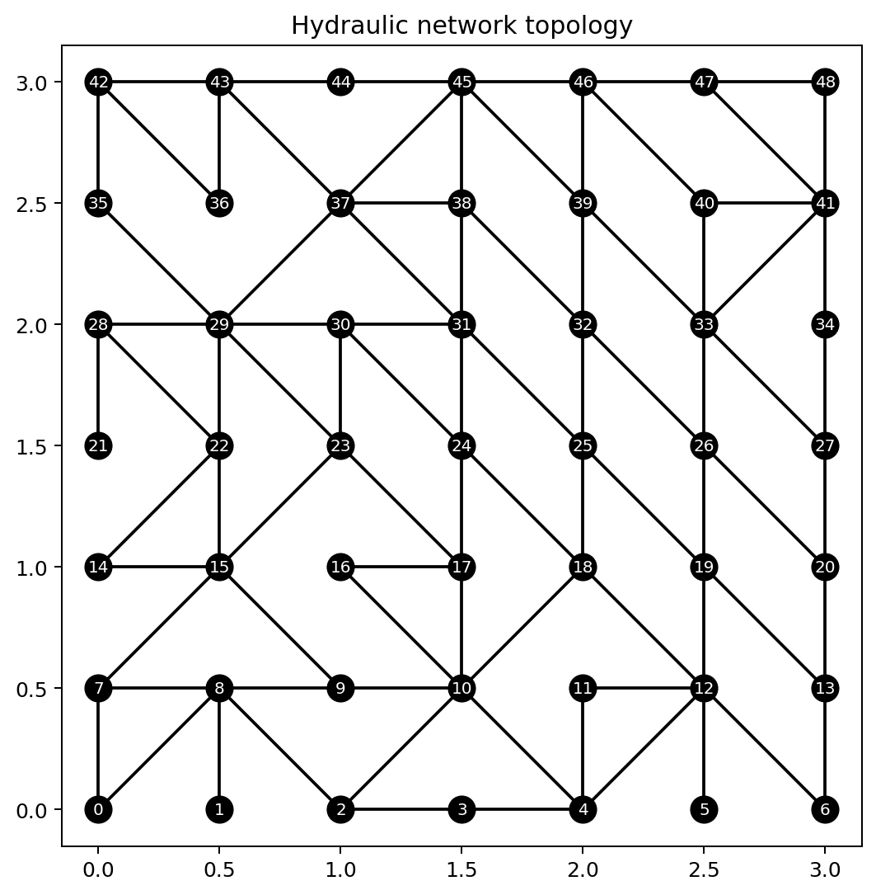
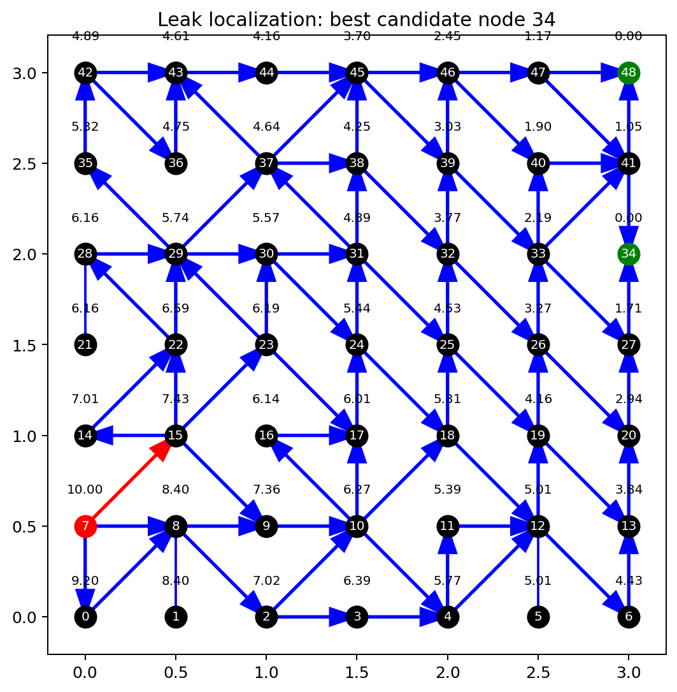
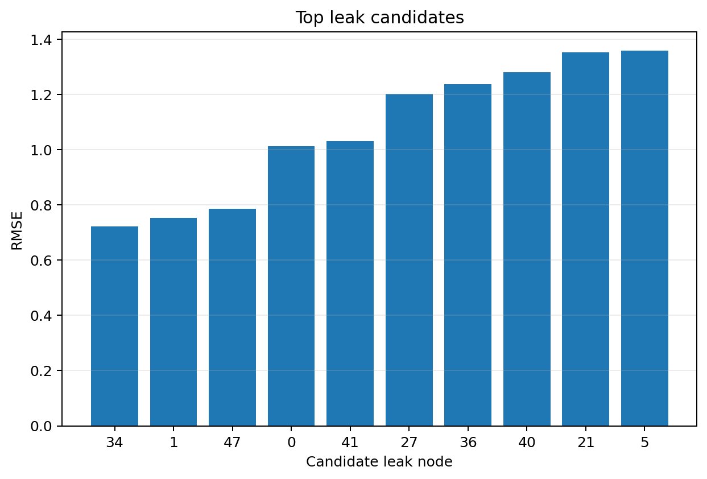

# Hydraulic Network Leak Detection

Numerical modelling of a hydraulic network as a weighted graph, pressure-system resolution with **Cramer's rule** and **Cholesky factorization**, and leak localization from partial pressure measurements.

This project was completed in **GM3 at INSA Rouen Normandie** as part of a numerical analysis practical project.

## Overview

A hydraulic network is represented as a graph:

- nodes represent junctions;
- edges represent pipes;
- edge conductances model how easily water flows between connected nodes;
- node pressures are the unknowns of the model.

Using the node conservation law, the problem is written as a linear system

\[
A p = b,
\]

where `A` is derived from the weighted graph Laplacian and Dirichlet boundary conditions impose known inlet and outlet pressures.

The project has three main goals:

1. build and visualize hydraulic networks;
2. solve the pressure system numerically;
3. identify the most plausible leak node from a small set of pressure measurements.

## Numerical methods

### Cramer's rule

A direct determinant-based solver is implemented as a theoretical reference for small systems. Its computational cost makes it unsuitable for the larger network.

### Cholesky factorization

For the symmetric positive-definite system obtained after imposing boundary conditions, the project implements

\[
A = LL^T,
\]

followed by forward and backward substitutions.

### Leak detection

A leak candidate is modelled by imposing a zero-pressure Dirichlet condition at a candidate node. For each candidate:

1. solve the modified pressure system;
2. predict pressures at sensor nodes;
3. compare predictions with measurements;
4. compute the RMSE;
5. rank candidates by increasing RMSE.

For the provided large-network experiment, the best candidate is **node 34**, consistent with the project report.

## Repository structure

```text
hydraulic-network-leak-detection/
├── src/
│   ├── hydraulic_network/
│   │   ├── __init__.py
│   │   ├── solvers.py
│   │   ├── network.py
│   │   ├── leak_detection.py
│   │   └── visualization.py
│   ├── main.py
│   └── generate_network.py
├── data/
│   ├── simple/
│   └── large/
├── tests/
│   └── test_numerics.py
├── results/
│   └── figures/
├── docs/
│   └── report.pdf
├── requirements.txt
├── .gitignore
└── README.md
```

## Installation

```bash
python3 -m venv .venv
source .venv/bin/activate
pip install -r requirements.txt
```

## Usage

Run the interactive program from the repository root:

```bash
python3 src/main.py
```

Generated visualizations are automatically saved as PNG files in `results/figures/` before being displayed.

The menu provides three modes:

```text
1. Visualize a network
2. Solve the pressure system
3. Detect the most plausible leak
```

Generate a new random 7x7 network with:

```bash
python3 src/generate_network.py
```


## Example results

### Hydraulic network



### Pressure field and detected leak



### Leak-candidate ranking



## Tests

```bash
python3 -m unittest discover -s tests -v
```

The tests verify the custom Cramer and Cholesky solvers against NumPy and reproduce the leak-ranking result on the supplied large network.

## Technologies

- Python
- NumPy
- Matplotlib
- graph Laplacian modelling
- Cholesky factorization
- numerical linear algebra
- RMSE-based model comparison

## Authors

- Manh Hung Nguyen
- Tan Minh Duy Ngo

Academic project — INSA Rouen Normandie, GM3.
